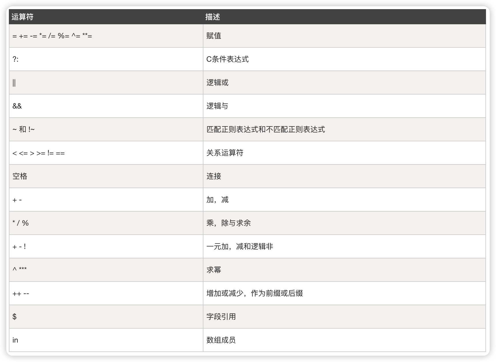

- [基本用法](#基本用法)
- [运算符](#运算符)
- [内建变量](#内建变量)
- [使用正则，字符串匹配](#使用正则字符串匹配)
- [忽略大小写](#忽略大小写)
- [模式取反](#模式取反)
- [awk脚本](#awk脚本)
- [另外一些实例](#另外一些实例)

AWK 是一种处理文本文件的语言，是一个强大的文本分析工具。
 
之所以叫 AWK 是因为其取了三位创始人 Alfred Aho，Peter Weinberger, 和 Brian Kernighan 的 Family Name 的首字符。\

**相关链接**
- https://www.runoob.com/linux/linux-comm-awk.html

语法：

```
awk [选项参数] 'script' var=value file(s)
或
awk [选项参数] -f scriptfile var=value file(s)
```

选项参数说明：

- -F fs or --field-separator fs
指定输入文件折分隔符，fs是一个字符串或者是一个正则表达式，如-F:。
- -v var=value or --asign var=value
赋值一个用户定义变量。
- -f scripfile or --file scriptfile
从脚本文件中读取awk命令。
- -mf nnn and -mr nnn
对nnn值设置内在限制，-mf选项限制分配给nnn的最大块数目；-mr选项限制记录的最大数目。这两个功能是Bell实验室版awk的扩展功能，在标准awk中不适用。
- -W compact or --compat, -W traditional or --traditional
在兼容模式下运行awk。所以gawk的行为和标准的awk完全一样，所有的awk扩展都被忽略。
- -W copyleft or --copyleft, -W copyright or --copyright
打印简短的版权信息。
- -W help or --help, -W usage or --usage
打印全部awk选项和每个选项的简短说明。
- -W lint or --lint
打印不能向传统unix平台移植的结构的警告。
- -W lint-old or --lint-old
打印关于不能向传统unix平台移植的结构的警告。
- -W posix
打开兼容模式。但有以下限制，不识别：/x、函数关键字、func、换码序列以及当fs是一个空格时，将新行作为一个域分隔符；操作符**和**=不能代替^和^=；fflush无效。
- -W re-interval or --re-inerval
允许间隔正则表达式的使用，参考(grep中的Posix字符类)，如括号表达式[[:alpha:]]。
- -W source program-text or --source program-text
使用program-text作为源代码，可与-f命令混用。
- -W version or --version
打印bug报告信息的版本。

## 基本用法

log.txt 内容如下

```
2 this is a test
3 Do you like awk
This's a test
10 There are orange,apple,mongo
```

用法一：

```bash
# 默认按空格或TAB分割，输出文本中1、4项
awk '{print $1,$4}' log.txt
----------------------------
2 a
3 like
This's 
10 orange,apple,mongo
```

用法二：

```bash
# 使用 awk 内置变量使用 , 分割
awk -F, '{print $1,$2}' log.txt
----------------------------
2 this is a test 
3 Do you like awk 
This 's a test 
10 There are orange apple

# 或者使用内建变量
awk 'BEGIN{FS=","} {print $1,$2}' log.txt
----------------------------
2 this is a test 
3 Do you like awk 
This's a test 
10 There are orange apple

# 使用多个分隔符.先使用空格分割，然后对分割结果再使用","分割
awk -F '[ ,]' '{print $1,$2,$5}' log.txt
----------------------------
2 this test
3 Do awk
This's a 
10 There apple
```

用法三：

```bash
# 定义变量
awk -v a=1 '{print $1,$1+a}' log.txt
----------------------------
2 3
3 4
This's 1
10 11
```

用法四：

```bash
# 使用脚本规则
awk -f cal.awk log.txt
```

## 运算符

  

输出第一列大于 2 行的行

```bash
awk '$1>2' log.txt
----------------------------
3 Do you like awk
This's a test
10 There are orange,apple,mongo
```

输出第一列等于 2 的行

```bash
awk '$1==2' log.txt
----------------------------
2 this is a test
# 联合输出语句输出第 1，3 位的内容
awk '$1==2 {print $1,$3}' log.txt
----------------------------
2 is
```

输出第一列大于 2 且第三列等于 "are" 的行

```bash
awk '$1>2 && $3=="are"' log.txt
----------------------------
10 There are orange,apple,mongo
# 联合输出语句第 1，2，3 位内容
awk '$1>2 && $3=="are" {print $1,$2,$3}' log.txt
----------------------------
10 There are
```

## 内建变量

| 变量      | 描述                                            |
| ----------- | ------------------------------------------------- |
| $n          | 当前记录的第n个字段，字段间由FS分隔 |
| $0          | 完整的输入记录                             |
| ARGC        | 命令行参数的数目                          |
| ARGIND      | 命令行中当前文件的位置(从0开始算)  |
| ARGV        | 包含命令行参数的数组                    |
| CONVFMT     | 数字转换格式(默认值为%.6g)ENVIRON环境变量关联数组 |
| ERRNO       | 最后一个系统错误的描述                 |
| FIELDWIDTHS | 字段宽度列表(用空格键分隔)            |
| FILENAME    | 当前文件名                                   |
| FNR         | 各文件分别计数的行号                    |
| FS          | 字段分隔符(默认是任何空格)            |
| IGNORECASE  | 如果为真，则进行忽略大小写的匹配  |
| NF          | 一条记录的字段的数目                    |
| NR          | 已经读出的记录数，就是行号，从1开始 |
| OFMT        | 数字的输出格式(默认值是%.6g)           |
| OFS         | 输出字段分隔符，默认值与输入字段分隔符一致。 |
| ORS         | 输出记录分隔符(默认值是一个换行符) |
| RLENGTH     | 由match函数所匹配的字符串的长度      |
| RS          | 记录分隔符(默认是一个换行符)         |
| RSTART      | 由match函数所匹配的字符串的第一个位置 |
| SUBSEP      | 数组下标分隔符(默认值是/034)           |

```bash
awk 'BEGIN{printf "%4s %4s %4s","FILENAME","FS\n","----------------\n"} {printf "%4s %4s\n",FILENAME,NF}' log.txt
----------------------------
FILENAME  FS
 ----------------
log.txt    5
log.txt    5
log.txt    3
log.txt    4
# 输出顺序号 NR, 匹配文本行号
awk '{print NR,FNR,$1,$2,$3}' log.txt
----------------------------
1 1 2 this is
2 2 3 Are you
3 3 This's a test
4 4 10 There are
# 指定输出分隔符 $
awk '{print $1,$2,$3}' OFS=" $ " log.txt
----------------------------
2 $ this $ is
3 $ Are $ you
This's $ a $ test
10 $ There $ are
```

## 使用正则，字符串匹配

```bash
# 输出第二列包含 "th"，并打印第二列与第四列
awk '$2 ~ /th/ {print $2,$4}' log.txt
----------------------------
this a
```

~ 表示模式开始。// 中是模式。

```bash
# 输出包含 "re" 的行
awk '/re/' log.txt
----------------------------
3 Are you like awk
10 There are orange,apple,mongo
```

## 忽略大小写

```bash
# MacOS 下测试无效
awk 'BEGIN{IGNORECASE=1} /this/' log.txt
----------------------------
2 this is a test
This's a test
```

## 模式取反

```bash
# 输出第二列不包含 th 的行，并打 2，4 列
awk '$2 !~ /th/ {print $2,$4}' log.txt
----------------------------
Are like
a
There orange,apple,mongo
# 输出不包含 th 的行，并打 2，4 列
awk '!/th/ {print $2,$4}' log.txt
Are like
a
There orange,apple,mongo
```

## awk脚本

- BEGIN{执行前的语句}
- {处理每一行时要执行的语句}
- END {处理完所有的行后要执行的语句}

score.txt 文件如下

```
Marry   2143 78 84 77
Jack    2321 66 78 45
Tom     2122 48 77 71
Mike    2537 87 97 95
Bob     2415 40 57 62
```

cal.awk 脚本如下：

```bash
#!/bin/awk -f
#运行前
BEGIN {
    math = 0
    english = 0
    computer = 0
 
    printf "NAME    NO.   MATH  ENGLISH  COMPUTER   TOTAL\n"
    printf "---------------------------------------------\n"
}
#运行中
{
    math+=$3
    english+=$4
    computer+=$5
    printf "%-6s %-6s %4d %8d %8d %8d\n", $1, $2, $3,$4,$5, $3+$4+$5
}
#运行后
END {
    printf "---------------------------------------------\n"
    printf "  TOTAL:%10d %8d %8d \n", math, english, computer
    printf "AVERAGE:%10.2f %8.2f %8.2f\n", math/NR, english/NR, computer/NR
}
```

执行效果

```bash
awk -f cal.awk score.txt
NAME    NO.   MATH  ENGLISH  COMPUTER   TOTAL
---------------------------------------------
Marry  2143     78       84       77      239
Jack   2321     66       78       45      189
Tom    2122     48       77       71      196
Mike   2537     87       97       95      279
Bob    2415     40       57       62      159
---------------------------------------------
  TOTAL:       319      393      350
AVERAGE:     63.80    78.60    70.00
```

## 另外一些实例

AWK 的 Hello World

```bash
BEGIN { print "Hello, world!" }
```

计算文件大小

```bash
ls -l *.txt | awk '{sum+=$5} END {print sum}'
```

从文件中找出长度大于 80 的行：

```bash
awk 'length>80' log.txt
```

打印九九乘法表

```bash
seq 9 | sed 'H;g' | awk -v RS='' '{for(i=1;i<=NF;i++)printf("%dx%d=%d%s", i, NR, i*NR, i==NR?"\n":"\t")}'
```