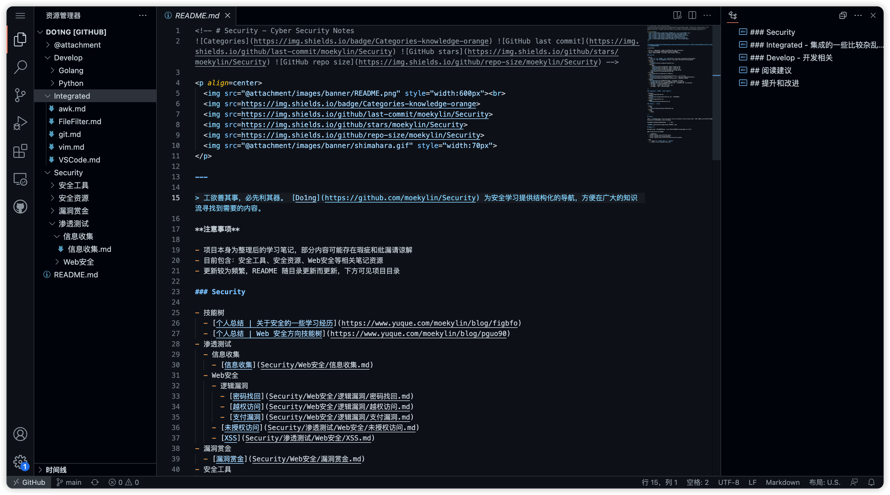

<!-- # Security - Cyber Security Notes
    -->

<p align=center>
  <br>
  
  
  
  
  
</p>

---

> 工欲善其事，必先利其器。 [Do1ng](https://github.com/moekylin/Security) 为安全学习提供结构化的导航，方便在广大的知识流寻找到需要的内容。

**注意事项**

- 项目本身为整理后的学习笔记，部分内容可能存在瑕疵和纰漏请谅解
- 目前包含：安全工具、安全资源、Web安全等相关笔记资源
- 前置学习路线可以参考：[关于安全的一些学习经历](https://www.yuque.com/moekylin/blog/figbfo)
- 更新较为频繁，README 随目录更新而更新，下方可见项目目录

## 项目目录

### Security 安全技能

- 安全工具 - 安全工具相关链接、使用示例
  - [ExploitTools](Security/安全工具/ExploitTools.md) - 漏洞利用工具
  - [ScanTools](Security/安全工具/ScanTools.md) - 扫描工具
  - [TrafficTools](Security/安全工具/TrafficTools.md) - 流量工具
- 安全资源
  - [安全书籍](Security/安全资源/安全书籍.md) - 信息安全从业者书单
  - [安全文库](Security/安全资源/安全文库.md) - 漏洞文库、知识文库收集
  - [安全文章](Security/安全资源/安全文章.md) - 安全入门文章
  - [靶场资源](Security/安全资源/靶场资源.md) - 专项靶场、主机靶场、在线靶场
  - [暂未分类](Security/安全资源/暂未分类.md) - 搜索引擎、面试相关、暂未分类
- 渗透测试
  - [Web安全](Security/渗透测试/Web安全)
    - [XSS](Security/渗透测试/Web安全/XSS.md)  #TODO
    - [未授权访问](Security/渗透测试/Web安全/未授权访问.md) #TODO
    - [逻辑漏洞](Security/渗透测试/Web安全/逻辑漏洞.md)
  - 信息收集
    - [信息收集](Security/渗透测试/信息收集/信息收集.md) - 域名信息收集、子域名信息收集等
    - [空间测绘](Security/渗透测试/信息收集/空间测绘.md) - 空间测绘信息收集资源
- [漏洞赏金](Security/漏洞赏金.md) - 相关资源、相关案例、相关技巧、赏金平台

### Develop 开发技能

- [编程学习资源](Develop/编程学习资源.md) 学习路线、相关资源、相关书籍
  - Python
  - Golang
  - JavaScript

### Integrated 杂项技能

- [FileFilter](Integrated/FileFilter.md) 文件批处理
- [awk](Integrated/awk.md) 文本数据处理
- [git](Integrated/git.md) 仓库管理、Push、Pull
- [vim](Integrated/vim.md) vim编辑器相关
- [VSCode](Integrated/VSCode.md) 快捷键、拓展、配置

### Network 网络技能

- [网络学习资源](Network/网络学习资源.md) HTTP、TCP/IP 相关链接、相关书籍

## 阅读建议

全文使用 [VSCode](https://azure.microsoft.com/zh-cn/products/visual-studio-code/) 排版, 生成导航目录，如果想获得更好阅读体验，可以将项目 clone 至本地阅读

或者你可以按下键盘上英文状态下的 `.` 在线预览



## 提升和改进

如果你有好的建议或者需求可以提出 issue 或者发送邮件至 moekylin@qq.com 联系我

最后希望这个仓库能帮助到你。

## Reference

- <https://github.com/ffffffff0x/1earn>

## 更新日志

```
2022-09-13 更新目录结构、删减多余内容
```
