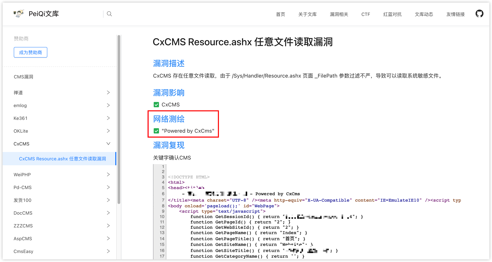
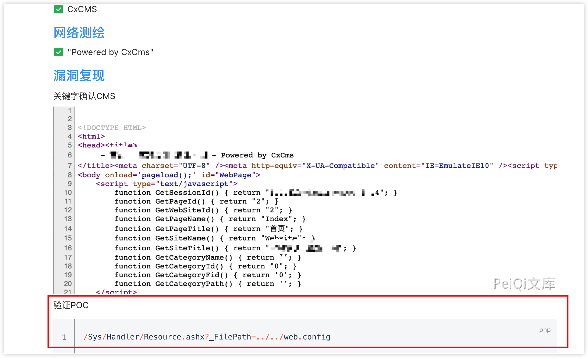

- [小白鼠日记](#小白鼠日记)
  - [一次尝试批量上分的实验](#一次尝试批量上分的实验)
    - [1. 寻找目标](#1-寻找目标)
    - [2. 脆弱点检测](#2-脆弱点检测)
    - [3. 批量检测](#3-批量检测)
    - [4. 站点信息](#4-站点信息)
    - [5. 提交报告](#5-提交报告)
- [附录: 国内应急响应中心](#附录-国内应急响应中心)
- [附录: 相关链接](#附录-相关链接)

## 小白鼠日记

### 一次尝试批量上分的实验

相关知识点
- 互联网寻找 nday poc
- 搜索引擎搜索脆弱资产
- 利用 poc 检测站点
- 脚本批量进行测试

漏洞提交平台
- [https://www.vulbox.com/](https://www.vulbox.com/)

Nday寻找途径
- [OA产品漏洞](http://wiki.peiqi.tech/wiki/oa/)
- [CMS漏洞](http://wiki.peiqi.tech/wiki/cms/)

#### 1. 寻找目标

利用语句搜索脆弱目标,包括但不限于 fofa 等搜索引擎

 

#### 2. 脆弱点检测

找到相应利用过程,利用POC检测漏洞是否存在,包括但不限于文库提供的 POC

#### 3. 批量检测

单个 POC 可利用后编写脚本批量对所有可能存在的站点测试(带有破坏型的POC请慎重),具体参见 [网络安全法](http://www.gov.cn/xinwen/2016-11/07/content_5129723.htm),批量检测脚本可以在网络上寻找,或者是自己编写.

搜索方式
- github搜索相关框架 + 漏洞编号

#### 4. 站点信息

主要针对站点: 归属厂商\权重

归属查询: 企查查等

#### 5. 提交报告

如 [如何更快的提交一份漏洞报告](https://xz.aliyun.com/t/6662),全部与文章内容反着来就行了

## 附录: 国内应急响应中心

- [SRCs|安全应急响应中心](http://0xsafe.org/index.html) 统计的比较全面的
- [字节跳动安全应急响应中心](https://security.bytedance.com/) 包括但不限于：今日头条、抖音、西瓜视频、懂车帝、GOGOKID、皮皮虾、飞书、番茄小说、Faceu激萌、轻颜相机
- [火线安全平台](https://www.huoxian.cn/project/list) 包括但不限于：美团、嘀嗒出行、Keep、知乎
- [快手安全应急响应中心](https://security.kuaishou.com/)
- [补天互联网漏洞响应平台](https://www.butian.net/)
- [漏洞盒子安全众测平台](https://www.vulbox.com/)

## 附录: 相关链接

- [那些年挖过的SRC之我是捡漏王](https://www.freebuf.com/vuls/198327.html)
- [如何快速上榜公益SRC](https://cloud.tencent.com/developer/article/1799928)