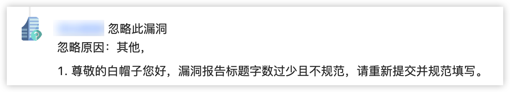

- [国内应急响应中心](#国内应急响应中心)
- [一些没用的小TIPS](#一些没用的小tips)
  - [漏洞盒子](#漏洞盒子)
  - [补天](#补天)

**相关链接**
- 那些年挖过的SRC之我是捡漏王：https://www.freebuf.com/vuls/198327.html
- 如何快速上榜公益SRC：https://cloud.tencent.com/developer/article/1799928)
- 重生之我是赏金猎人系列：https://github.com/J0o1ey/BountyHunterInChina
- 刷SRC经验之批量化扫描实践：https://www.freebuf.com/sectool/176562.html

## 国内应急响应中心

- [SRCs|安全应急响应中心](http://0xsafe.org/index.html) 统计的比较全面的
- [字节跳动安全应急响应中心](https://security.bytedance.com/) 包括但不限于：今日头条、抖音、西瓜视频、懂车帝、GOGOKID、皮皮虾、飞书、番茄小说、Faceu激萌、轻颜相机
- [火线安全平台](https://www.huoxian.cn/project/list) 包括但不限于：美团、嘀嗒出行、Keep、知乎
- [快手安全应急响应中心](https://security.kuaishou.com/)
- [补天互联网漏洞响应平台](https://www.butian.net/)
- [漏洞盒子安全众测平台](https://www.vulbox.com/)

## 一些没用的小TIPS

### 漏洞盒子
- 漏洞提交标题：厂商+漏洞
- 漏洞复现：必要带截图说明

  

### 补天
- 公益漏洞条件：百度权重/移动权重>=1，或者Google权重>=3