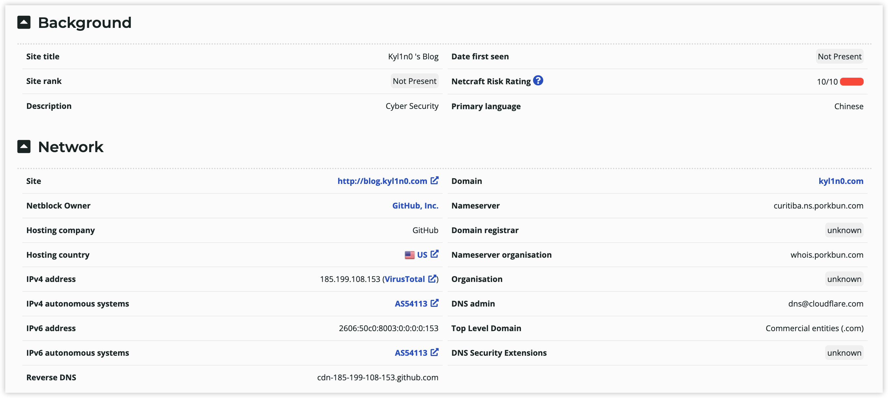

- [信息收集概述](#信息收集概述)
- [常用收集方式](#常用收集方式)
  - [IP反向查域名](#ip反向查域名)
  - [WHOIS查询](#whois查询)
  - [备案信息收集](#备案信息收集)
  - [子域名信息收集](#子域名信息收集)
  - [CMS指纹识别 #TODO](#cms指纹识别-todo)
  - [敏感信息收集 #TODO](#敏感信息收集-todo)
  - [WAF识别 #TODO](#waf识别-todo)
- [相关链接](#相关链接)

## 信息收集概述

**主动信息收集与被动信息收集：** 信息收集通常分为被动信息收集和主动信息收集，主动信息收集是通过主动访问和扫描等方式主动获取信息，缺点是容易造成大量的日志；被动信息是通过第三方服务收集，如 http://fofa.info 等，缺点是可以收集到的信息有限。信息收集是渗透测试中很重要的一部分，信息收集越全面对后续的攻击帮助越大。

## 常用收集方式

### IP反向查域名

某些站点存在无法通过搜索引擎定位归属时，这里放几个IP反查域名的网站
- https://site.ip138.com/
- https://dns.aizhan.com/

### WHOIS查询

很明显我也不理解这一步是要干什么，注册者现在大部分公共查询网站已经被置空了，主要能看到域名在哪个厂商注册，注册时间、到期时间等，查了几个大部分都是归属于阿里巴巴，下面是几个可以使用的 WHOIS 查询站
- [ChinaZ](http://whois.chinaz.com/)
- [阿里云WHOIS](https://whois.aliyun.com/whois/domain/)
- [爱站WHOIS](https://whois.aizhan.com/)
- [全球WHOIS](https://www.whois365.com/cn)

补充一下，还是有些 WHOIS 查询站可以获取有用信息的，下面列举一下
- https://whois.domaintools.com/ 可以查询到IP地址、IP地址所拓展的站点等信息。
- https://sitereport.netcraft.com/ 可以收集到的信息还是蛮多的，可以把侧重点放在这里
  
- https://www.robtex.com/ 主要查 DNS 解析

目前的理解是通过WHOIS查询可以快速得到域名的IP端、DNS解析、注册时间、地址等信息，或许运用合理可以巧妙的绕过CDN。

### 备案信息收集

针对国内站点且经过备案的站点，主要收集到主办单位名称（企业名称）、ICP备案号，查询方式可以输入备案号、主板单位名称、域名、法定代表人等信息。以下站点根据使用次数，不定期排序。
- ICP备案查询网：https://www.beianx.cn/
- ChinaZ备案查询：https://icp.chinaz.com/
- CnGov：https://beian.miit.gov.cn/#/Integrated/recordQuery

以下两家更加针对于企业备案信息查询
- 企查查：https://www.qcc.com/
- 天眼查：https://www.tianyancha.com/

网站备案信息收集更加方便定位资产到具体的公司、所处省、市区等信息，注册人信息在构建字典时或许能用得上。

### 子域名信息收集

这一部分是攻防演练中的侧重点，主要针对子域名下的脆弱资产进行收集和识别，涉及到的东西可能比较多，这里罗列一点简单的思路。

Google语法
- site:example.com
- https://kyl1n0.github.io/GoogleHackingTool/

在线查询站点
- https://dnsdumpster.com/
- https://www.virustotal.com/gui/home/url

通过证书透明度公开日志枚举子域名
>证书透明度是证书授权机构的一个项目，证书授权机构会将每个SSL/TLS证书发布到公共日志中。一个SSL/TLS证书通常包含域名、子域名和邮件地址，这些也经常成为攻击者非常希望获得的有用信息。
- crt.sh：https://crt.sh
- censys：https://censys.io

常用工具
- https://github.com/shmilylty/OneForAll
- https://github.com/knownsec/ksubdomain
- https://github.com/boy-hack/ksubdomain 功能少于第二个，但是更易上手

### CMS指纹识别 #TODO

### 敏感信息收集 #TODO

### WAF识别 #TODO

## 相关链接

- [Web渗透测试：信息收集篇](https://www.freebuf.com/articles/network/251083.html)
- [子域名信息收集总结](https://blog.csdn.net/qq_41880069/article/details/83037081)