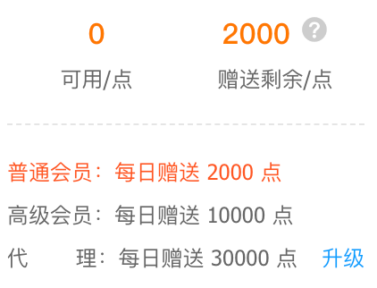

- [信息收集概述](#信息收集概述)
- [域名信息收集](#域名信息收集)
  - [IP反向查域名](#ip反向查域名)
  - [WHOIS查询](#whois查询)
  - [备案信息收集](#备案信息收集)
- [子域名信息收集](#子域名信息收集)
  - [搜索引擎收集](#搜索引擎收集)
  - [在线子域名收集网站](#在线子域名收集网站)
  - [通过证书透明度公开日志收集](#通过证书透明度公开日志收集)
  - [利用工具枚举子域名](#利用工具枚举子域名)
  - [政府网站信息收集](#政府网站信息收集)
- [站点信息收集](#站点信息收集)
  - [CMS指纹识别](#cms指纹识别)
  - [站点目录收集 #TODO](#站点目录收集-todo)
  - [WAF识别 #TODO](#waf识别-todo)
- [SRC-SEO查询](#src-seo查询)
  - [权重查询](#权重查询)
  - [备案查询](#备案查询)
- [相关链接](#相关链接)

## 信息收集概述

**主动信息收集与被动信息收集：** 信息收集通常分为被动信息收集和主动信息收集，主动信息收集是通过主动访问和扫描等方式主动获取信息，缺点是容易造成大量的日志；被动信息是通过第三方服务收集，如 http://fofa.info、http://crt.sh 等，缺点是可以收集到的信息有限。信息收集是渗透测试中很重要的一部分，信息收集越全面对后续的攻击帮助越大。

## 域名信息收集

- **IP反向查找域名：** 某些站点存在无法通过搜索引擎定位归属时，通过反向查询到域名信息
- **WHOIS查询：** 通过WHOIS查询可以快速得到域名的IP段、DNS解析、注册时间、地址等信息，或许运用合理可以巧妙的绕过CDN。
- **备案信息收集：** 网站备案信息收集更加方便定位资产到具体的企业名称、ICP备案号、备案人名称、公司、所处省、市区等信息。

### IP反向查域名
- https://site.ip138.com/
- https://dns.aizhan.com/
- https://webscan.cc/

### WHOIS查询
- **常用**
  - https://whois.domaintools.com/ 可以查询到IP地址、IP地址所拓展的站点等信息。
  - https://sitereport.netcraft.com/ 可以收集到的信息还是蛮多的，可以把侧重点放在这里
  - https://www.robtex.com/ 主要查 DNS 解析
- **其他**
  - [ChinaZ](http://whois.chinaz.com/)
  - [阿里云WHOIS](https://whois.aliyun.com/whois/domain/)
  - [爱站WHOIS](https://whois.aizhan.com/)
  - [全球WHOIS](https://www.whois365.com/cn)

### 备案信息收集
- **常用：**
  - 理论上最常用的：https://www.beianx.cn/
  - 站长工具查询：https://icp.chinaz.com/
  - GOV.CN查询：https://beian.miit.gov.cn/#/Integrated/recordQuery
- **针对企业查询：**
  - 企查查：https://www.qcc.com/
  - 天眼查：https://www.tianyancha.com/

## 子域名信息收集
这一部分是攻防演练中的侧重点，主要针对子域名下的脆弱资产进行收集和识别，涉及到的东西可能比较多，这里罗列一点简单的思路。TIP：目前网上已经有很多现成的工具集成了大部分子域名收集方式，比较常用的可能是一个oneforall

### 搜索引擎收集
**Google语法**
- site:example.com
- https://www.exploit-db.com/google-hacking-database explot-db语法库
- https://kyl1n0.github.io/GoogleHackingTool/ 简单谷歌语法

### 在线子域名收集网站
- （目前来说通过站点在线收集的方式并不常用）
- https://dnsdumpster.com/
- https://www.virustotal.com/gui/home/url

### 通过证书透明度公开日志收集
>证书透明度是证书授权机构的一个项目，证书授权机构会将每个SSL/TLS证书发布到公共日志中。一个SSL/TLS证书通常包含域名、子域名和邮件地址，这些也经常成为攻击者非常希望获得的有用信息。
- crt.sh：https://crt.sh
- censys：https://censys.io

### 利用工具枚举子域名
- https://github.com/shmilylty/OneForAll 功能最齐全但是花费时间较长
- https://github.com/knownsec/ksubdomain 无状态子域名爆破工具
- https://github.com/boy-hack/ksubdomain 功能少于ksubdomain，但是更易上手

### 政府网站信息收集
- https://zfwzzc.www.gov.cn/

## 站点信息收集

### CMS指纹识别
- 工具
  - [ObserverWard](https://github.com/0x727/FingerprintHub) 有点过于强悍的，基于社区的指纹识别
    - ObserverWard 帮助文档：https://0x727.github.io/ObserverWard/
  - [WhatWeb](https://github.com/urbanadventurer/WhatWeb) 公认的比较强大的 web 扫描器，暂时还没用过
  - [whatweb-plus](https://github.com/winezer0/whatweb-plus) whatweb 针对国内的增强版
- 在线站点
  - http://finger.tidesec.com/ TideFinger：指纹库齐全功能强大
  - https://fp.shuziguanxing.com/ 360观星：速度较慢，但是可以用，第二选择
  - http://whatweb.bugscaner.com/look/ BugScaner 需要登录，而且为什么织梦CMS都识别不出来？
  - http://www.yunsee.cn/ 云悉：因为我没有账号不做评价
- 浏览器插件
  - [Wappalyzer Edge](https://microsoftedge.microsoft.com/addons/detail/wappalyzer-technology-p/mnbndgmknlpdjdnjfmfcdjoegcckoikn?hl=zh-CN)
  - [Wappalyzer Firefox](https://addons.mozilla.org/zh-CN/firefox/addon/wappalyzer/)
  - [Wappalyzer Chrome](https://chrome.google.com/webstore/detail/wappalyzer-technology-pro/gppongmhjkpfnbhagpmjfkannfbllamg?hl=zh-CN)

### 站点目录收集 #TODO
工具：
- 基于 Python
  - [wfuzz](../安全工具/wfuzz)
- Windows
  - 7kbscan
### WAF识别 #TODO

## SRC-SEO查询

SEO（Search Engine Optimization） 查询仅作为提交漏洞时的一个参考依据，并不完全参与渗透测试实战的信息收集，这里简单的几个比较常用的。

### 权重查询
> 站长工具的权重通计算大部分子域名，爱站只计算提交到搜索引擎的子域，如www。一般情况下爱站查询到的权重都会比站长工具低一级
- [站长工具综合权重查询](https://rank.chinaz.com/all)
- [爱站综合权重查询](https://www.aizhan.com/cha)

### 备案查询
- [批量备案查询](http://www.jucha.com/beian/) 每天2000次免费查询额度
  

## 相关链接

- [Web渗透测试：信息收集篇](https://www.freebuf.com/articles/network/251083.html)
- CMS指纹识别：[Information Collection Handbook](https://qftm.github.io/Information_Collection_Handbook/)
- CMS指纹识别：[Web指纹识别技术研究与优化实现](https://www.freebuf.com/articles/web/202560.html)