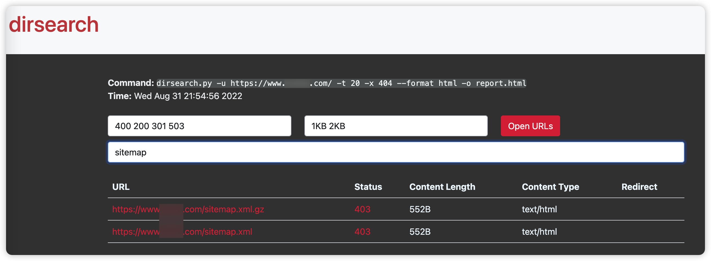

- [常用命令](#常用命令)
- [Example-1 大范围扫描](#example-1-大范围扫描)
- [Example-2 精确扫描](#example-2-精确扫描)

> 基于 Python 的 Web 目录扫描器 https://github.com/maurosoria/dirsearch

下载安装

```bash
# 下载最新版dirsearch
git clone https://github.com/maurosoria/dirsearch.git
# Linux下可以创建软链接 /Users/kylin/Penetration/ScanTools/dirsearch/dirsearch.py 为程序的绝对路径
ln -s /Users/kylin/Penetration/ScanTools/dirsearch/dirsearch.py /usr/local/bin/dirsearch
```

相关链接
- https://www.sqlsec.com/2019/12/macos.html#dirsearch

## 常用命令

```bash
dirsearch [options]
  -u URL  # 扫描单个 URL
  -l FILE # 扫描文件内 URL
  -w FILE # 使用自定义字典
  -e EXTENSIONS # 扫描指定拓展页面，例如 php，asp等
  --format html # 报告输出格式，例如：simple, plain, json, xml, md, csv, html, sqlite
  -o # 结果保存的目录 默认在 ~/report
  --max-time  # 超时时间/s
  -t # 指定线程数
  -i # 包含指定状态码，用,分隔
  -x # 排除指定状态码，用,分隔
```

## Example-1 大范围扫描
- 1-1 扫描所有结果保存到 report.txt
```bash
dirsearch -u http://www.vulnweb.com/ -t 20 --max-time 360 --format plain -o report.txt
```

- 1-2 扫描接所有结果保存到 report.html
```bash
dirsearch -u http://www.vulnweb.com/ -t 20 --max-time 360 --format html -o report.html
```
保存为 html 的结果在过滤时，不同的参数使用空格分隔
  


## Example-2 精确扫描
- 2-1 针对状态码将结果 URL 单独保存到 report_200.txt
``` bash
dirsearch -u http://www.vulnweb.com/ -t 20 --max-time 360 -i 200 --format simple -o report.txt
```