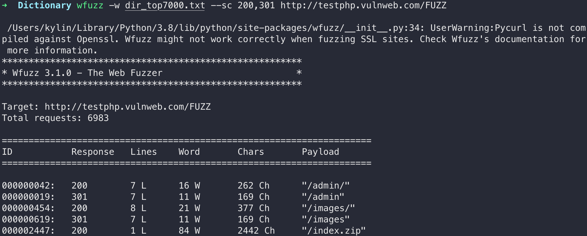

- [常用参数](#常用参数)
- [Example-1 目录扫描](#example-1-目录扫描)

> 基于 Python 的目录、参数、接口模糊测试 - https://github.com/xmendez/wfuzz

下载安装
```
# MacOS 需要重新装pycurl
# 1. 安装 openssl 并且添加至环境变量
brew install openssl
export LDFLAGS="-L/opt/homebrew/opt/openssl@3/lib"
export CPPFLAGS="-I/opt/homebrew/opt/openssl@3/include"
# 2. 安装pycurl以及wfuzz
pip uninstall pycurl
pip install --no-cache-dir pycurl==7.43.0.1 --global-option=build_ext --global-option="-L/usr/local/opt/openssl/lib" --global-option="-I/usr/local/opt/openssl/include" -i http://pypi.douban.com/simple --trusted-host pypi.douban.com
pip install wfuzz
```

相关链接
- [mac安装pycurl方案](https://segmentfault.com/q/1010000012674778)
- [Python pip Could not fetch URL 解决方案](https://blog.csdn.net/liulanba/article/details/115944889)
- [Wfuzz详细指南|模糊测试工具使用方法](https://www.ddosi.org/wfuzz-guide/)
- [Wfuzz初上手](https://gh0st.cn/archives/2018-10-28/1)

## 常用参数
```bash
# 查看所有模块
wfuzz -e payloads

# 过滤结果
-–hc/sc CODE #隐藏/显示响应代码
–-hl/sl NUM #ide/按响应行数显示
–-hw/sw NUM #ide/按响应的字数显示
–-hc/sc NUM #ide/按响应的字符数显示

# 输出格式
wfuzz -e printers # 查看所有可保存格式
wfuzz -o json # 以 json 格式输出
```

## Example-1 目录扫描
```bash
# FUZZ 处填入 dir_7000.txt 每行的内容，返回状态码为200,301 的结果
wfuzz -w dir_top7000.txt --sc 200,301 http://testphp.vulnweb.com/FUZZ
```
  