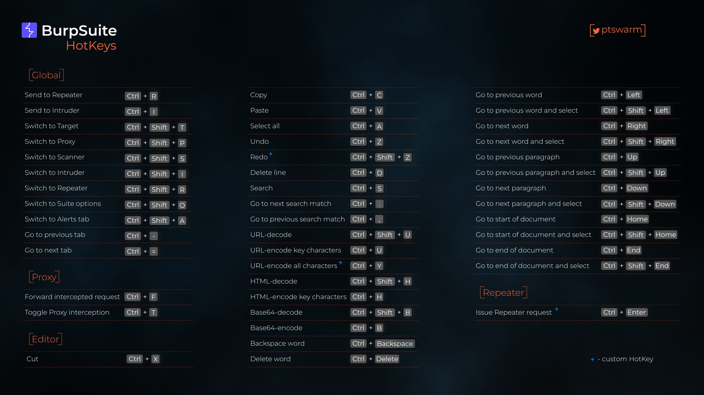
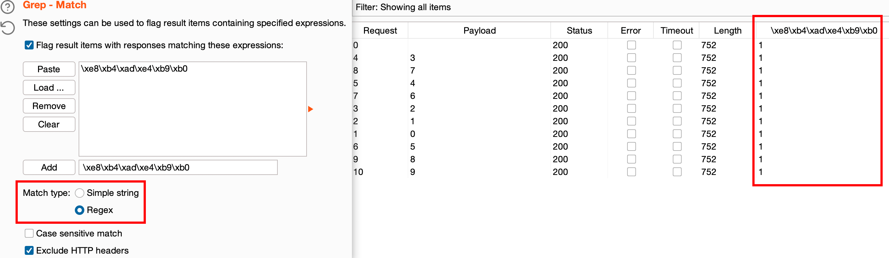

- [基础模块介绍](#基础模块介绍)
- [抓取命令行数据包](#抓取命令行数据包)
- [Autorize 越权检测插件](#autorize-越权检测插件)
- [Grep-Match 中文乱码](#grep-match-中文乱码)
- [抓取手机数据包](#抓取手机数据包)

  

下载安装
```diff
# MacOS
# 将BurpSuiteLoader.jar、burp-keygen-scz.jar 移动至 /Applications/Burp Suite Professional.app/Contents/Resources/app
# 编辑 /Applications/Burp Suite Professional.app/Contents/Info.plist 插入以下内容
<string>-Dexe4j.moduleName=$APP_PACKAGE</string>
++ <string>-noverify</string>  
++ <string>-javaagent:$APP_PACKAGE/Contents/Resources/app/BurpSuiteLoader.jar</string>

# 安装 java 环境
brew tap adoptopenjdk/openjdk
brew install cask adoptopenjdk11

# 运行注册机
cd /Applications/Burp Suite Professional.app/Contents/Resources/app
java -jar burp-keygen-scz.jar

# 启动台启动 BurpSuite 手动破解
```

相关链接
- 官方安装包: [Burp Suite Releases](https://portswigger.net/burp/releases)  
- 加载器: [Loader](https://raw.githubusercontent.com/x-Ai/BurpSuite/main/BurpSuiteLoader.jar)  
- 注册机: [Keygen](https://raw.githubusercontent.com/x-Ai/BurpSuite/main/burp-keygen-scz.jar)
- [一些相见恨晚的BurpSuite插件推荐](https://blog.csdn.net/weixin_37104668/article/details/104670704)
- [BurpSuite快捷键](https://zweilosec.gitbook.io/hackers-rest/web/burp-suite)
- [burpsuite实战指南](https://t0data.gitbooks.io/burpsuite/content/)
- [越权漏洞与autorize插件使用](https://blog.csdn.net/weixin_45557138/article/details/120876168)
- [Autorize插件的使用方法](https://blog.csdn.net/weixin_50464560/article/details/120235909)

## 基础模块介绍
| 模块名称  | 介绍                                                                      |
| --------- | ------------------------------------------------------------------------- |
| Proxy     | 拦截HTTP/S的代理服务器，可以作为中间人，拦截、查看、修改数据包            |
| Spider    | 网络爬虫模块，可以枚举出网络服务的内容和功能                              |
| Scanner   | Web应用漏洞扫描                                                           |
| Intruder  | 可用于枚举标识符、暴力破解、fuzzing探测常规漏洞                           |
| Repeater  | 可对数据包进行修改、重放，获取相应返回数据包                              |
| Sequencer | 是一个用来分析那些不可预知的应用程序会话令牌和重要数据项的随机性的工具。 |
| Decoder   | 手动或自动进行编码和解码等操作                                            |
| Comparer  | 主要提供一个可视化的差异比对功能，来对比分析两次数据之间的区别。 通常会配合Intruder模块进行                                                                         |

## 抓取命令行数据包

```
export http_proxy=localhost:8080
export https_proxy=localhost:8080
curl ifconfig.io
```

## Autorize 越权检测插件


## Grep-Match 中文乱码

将中文转换为UTF编码，将编码后勾选 Match type -> Regex 正则匹配

```python
# python 转换
str = '购买'
str.encode()
b'\xe8\xb4\xad\xe4\xb9\xb0'
```
  

## 抓取手机数据包

手机与电脑处于同一局域网，Burpsuite 监听新的端口，IP 选择 Wifi 或网线分配的 IP 地址